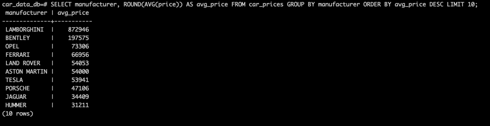

# Car Prices Portfolio

中古車データの前処理とSQL分析を行うポートフォリオプロジェクトです。  
Kaggleの車両価格データ（約2万件）をPythonで整形・保存し、PostgreSQLで集計・抽出を行いました。

---

##  元データ（Kaggle）

以下のKaggle Notebookから `train.csv` を使用しています：

 [Kaggle: Car Prices Notebook / Input Files](https://www.kaggle.com/code/ishan2851/car-prices-noteboook/input?select=train.csv)

---

## 📁 プロジェクト構成
```
car_prices_portfolio/
├── scripts/
│ ├── data_load.py ← CSVデータの読み込み（pandas）
│ ├── transform_data.py ← データ整形処理（欠損値処理、型変換など）
│ ├── save_to_db.py ← PostgreSQLへの保存処理（SQLAlchemy使用）
├── data/
│ ├── raw/ ← 元データ（除外）
│ └── processed/ ← 加工済みCSV（除外）
├── images/ ← SQL実行結果のスクリーンショットなど
├── requirements.txt ← 使用ライブラリ一覧
└── README.md ← このファイル
```


---

##  使用技術

- **Python 3.11**
  - pandas / numpy / sqlalchemy / psycopg2
- **PostgreSQL**
  - テーブル作成・データ保存・SQL集計
- **SQL手動実行**
  - クエリ実行結果はスクリーンショットにて記録

---

##  データ整形内容（transform_data.py）

- `Levy`: `"−"` を `NaN → float` に変換
- `Leather interior`: `"Yes/No"` → `True/False`
- `Engine volume`: 数値＋ `is_turbo` フラグに分割
- `Mileage`: `" km"` を除去し `int` に変換
- `Doors`: `"May"` や `"Mar"` の誤変換修正
- カラム名: 全体を `snake_case` に統一

---

## PostgreSQL保存（save_to_db.py）

- テーブル名：`car_prices`
- 主キー：`id SERIAL PRIMARY KEY`

---

## SQL分析（PostgreSQL）

## 📊 集計結果のサンプル

①ターボ車かどうかで最高価格（MAX）を集計した結果：


```sql
SELECT is_turbo, MAX(price) AS max_price
FROM car_prices
GROUP BY is_turbo;

② メーカーごとの平均価格上位１０位：



```sql
SELECT manufacturer, ROUND(AVG(price)) AS avg_price
FROM car_prices
GROUP BY manufacturer
ORDER BY avg_price DESC
LIMIT 10;

  
